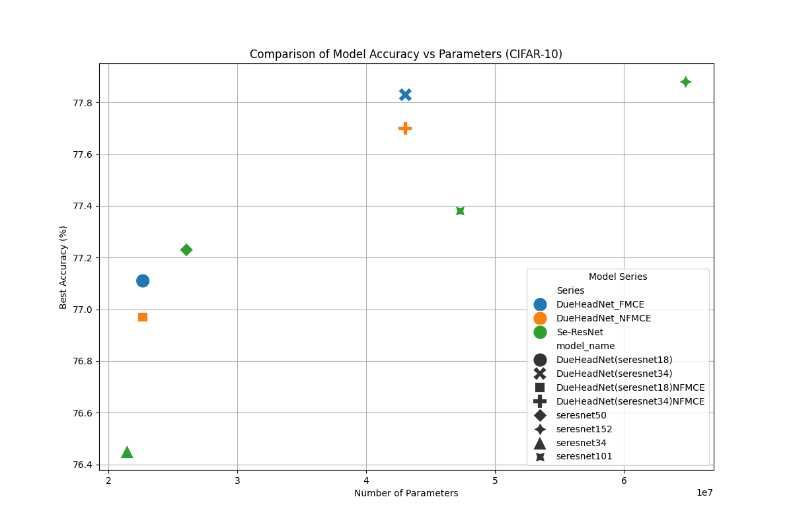
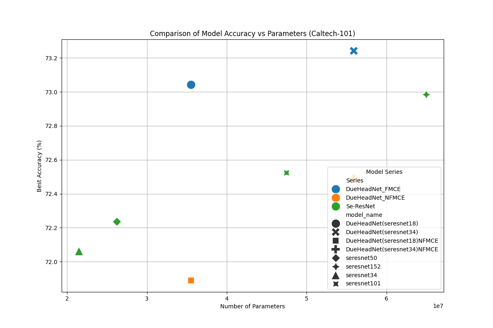
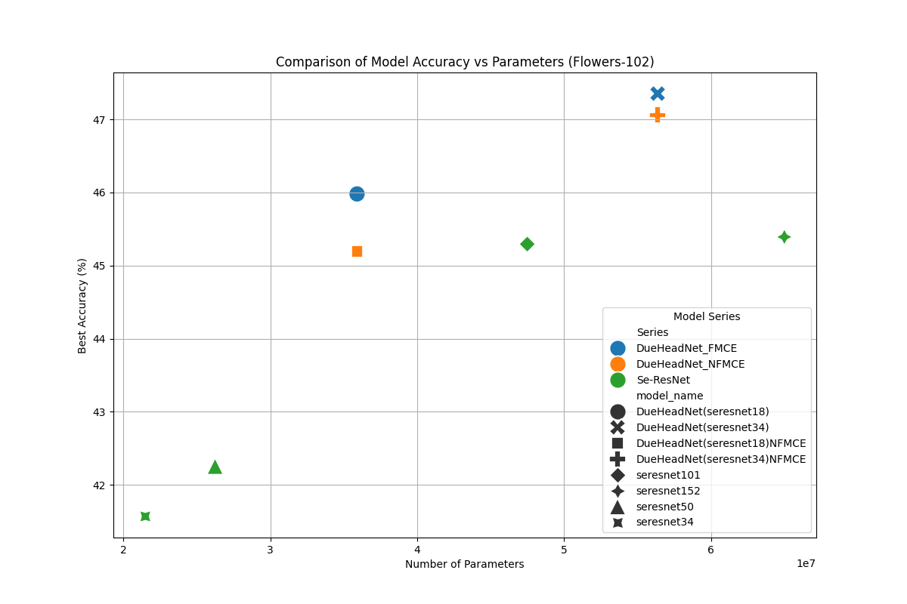

# Feature Map Constraints Enhance Learning

## Abstract

This study explores the application of Cosine Similarity Loss to constrain individual feature maps within multi-CNN head models, aiming to promote the learning of distinct features. Our approach specifically applies this loss function across each CNN within a framework composed of multiple CNN heads, each based on variations of the SE-ResNet architecture. We evaluate the effectiveness of this methodology by conducting comparative experiments on three datasets: CIFAR-10, Caltech-101, and Flower-102. The models compared include: multiple CNN heads with Cosine Similarity Loss constraints, multiple CNN heads without such constraints, and a single CNN head model. Each configuration utilizes different base models from the SE-ResNet series. This paper presents our findings, which suggest that the strategic use of Cosine Similarity Loss can significantly influence the feature-learning capabilities of CNN models, potentially leading to improvements in model performance across diverse datasets.

## Methodology

In this section, we describe the process followed to design a strong CNN architecture that maximizes feature extractive abilities with the dual-headed design. Leveraging the huge number of pre-trained models available within the timm library, the SE-ResNet series was chosen to combine into a new architecture that can adequately maximize the best features of many convolutional networks. This should further enhance generalization performance by learning various feature extraction mechanisms owing to the novel characteristics of our custom-built DueHeadNet.

### Multi-CNN Head Architecture Design

In our study, we utilize the `timm` library to construct our CNN models. This library offers a variety of pre-trained models from which we have selected the `seresnet` series for our architecture. The models used include `seresnet18`, `seresnet34`, `seresnet50`, `seresnet101`, and `seresnet152`.

We define a custom class named `DueHeadNet`, which is built to handle dual CNN heads. The constructor of this class takes parameters such as `num_classes`, which defines the number of output classes, `base_model`, specifying the type of SE-ResNet model to use, and `pretrain_model`.

Within this class, a new model instance (`model2`) is created using `timm.create_model`, which is configured to the specified `base_model` and number of classes. We also define a dictionary `feature_table` that maps each SE-ResNet model variant to its corresponding feature dimension output.

In the forward pass of the `DueHeadNet` class, the input image is passed through the base model (`model1`) and we use `forward_features` to extract the feature maps. Next, we pass the original image to `model2` to extract its feature maps. The feature maps from both models are stored in a list, and we add the two feature maps together to obtain the final feature maps. These final feature maps are then passed through the classifier to obtain the output.

### Application of Cosine Similarity Loss

In the Multi-CNN Head Architecture Design, we mentioned that we use two CNN heads for training, one of which is a pre-trained model. During the inference stage, we pass the input through both models and add the feature maps from both models together. This design allows model2 to compensate for the deficiencies of model1. During the training stage, we use Cosine Similarity Loss to encourage model1 and model2 to learn different features. This design aims to enhance the generalization ability of the models by learning diverse features.

When calculating the Cosine Similarity Loss, we treat the feature map output of model1 (the pre-trained model) as the target feature map, and the feature map output of model2 as the input feature map. This design aligns with the aforementioned objective of encouraging the models to learn different features.

In this study, the calculated Cosine Similarity Loss value is directly added to the CrossEntropyLoss value. This design simplifies the model complexity and facilitates model convergence.

### Model Training and Evaluation

We train our models using the PyTorch framework and the torchvision library.

We employ the AdamW optimizer with a learning rate of 4e-4 and a weight decay of 5e-4. Additionally, we apply a learning rate scheduler using CosineAnnealingLR with a maximum number of epochs set to 30. The total number of epochs is set to 30, and the batch size is set to 64.

Evaluation is performed using the Accuracy metric, which calculates the percentage of correctly predicted labels in the test dataset.

And The Accuracy formula is as follows:

$$Accuracy = \frac{Number of Correct Predictions}{Total Number of Predictions}$$

We compare the performance of the following models:

| Model Name | Series | Description |
| --- | --- | --- |
| Seresnet34 | SE-ResNet | SE-ResNet34 |
| Seresnet50 | SE-ResNet | SE-ResNet50 |
| Seresnet101 | SE-ResNet | SE-ResNet101 |
| Seresnet152 | SE-ResNet | SE-ResNet152 |
| DueHeadNet_FMCE | DueHeadNet | DueHeadNet with Feature Map Constraint Enhancement |
| DueHeadNet_NFMCE | DueHeadNet | DueHeadNet without Feature Map Constraint Enhancement |

## Results

### CIFAR-10

### Caltech-101

### Flower-102

## Discussion

The results from our experiments clearly demonstrate that implementing Cosine Similarity Loss to guide the learning of individual feature maps can enhance model performance. This enhancement is particularly notable in the Flower-102 dataset. We hypothesize that this significant improvement is due to the homogeneity of the dataset, which consists solely of flower images. The distinct and repetitive patterns in these images likely benefit more from the differentiated feature learning enforced by Cosine Similarity Loss constraints.

Moreover, the positive outcomes observed across all datasets underline the versatility and effectiveness of our approach in diverse visual contexts. By enforcing diversity in the feature representations learned by each CNN head, we prevent redundancy and encourage the extraction of unique, informative features, which is crucial for improving generalization in machine learning models.

Our findings suggest that the strategic application of Cosine Similarity Loss can be a powerful tool in enhancing the discriminative capabilities of CNN architectures, especially in scenarios where the dataset is visually uniform or when distinct feature delineation is beneficial. Further studies could explore the application of this methodology to other types of neural networks or to tasks beyond image classification to fully determine its potential and limitations.